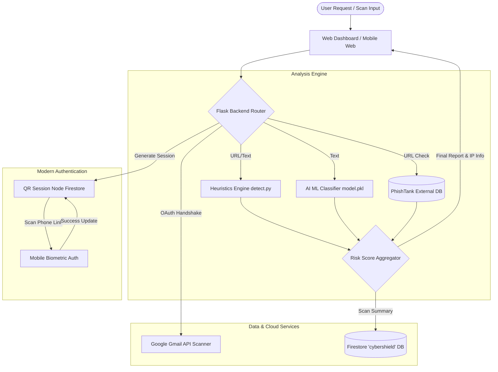
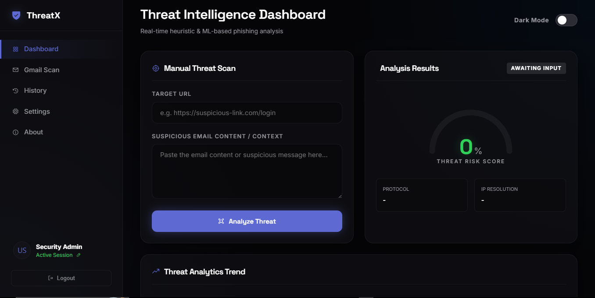
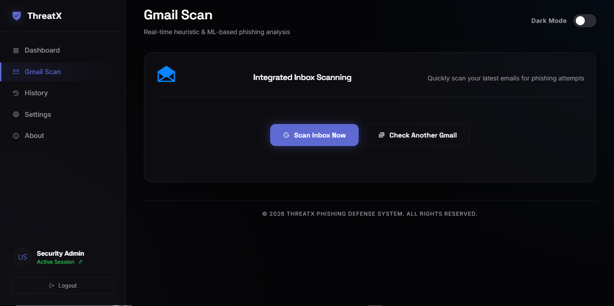
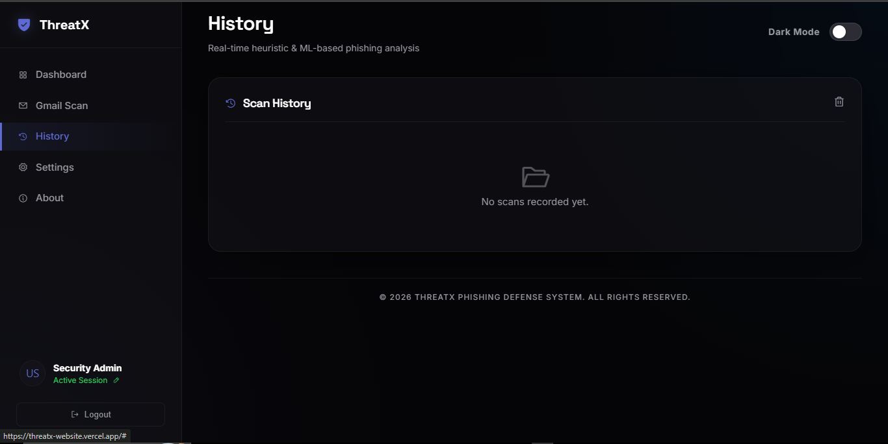
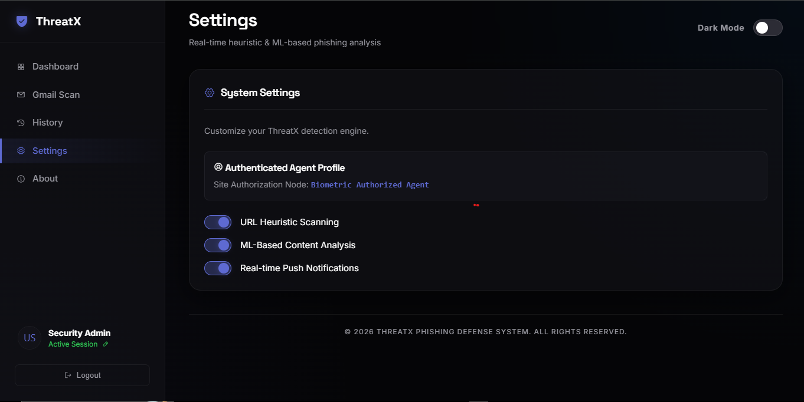

# 🛡️ ThreatX - Advanced Phishing & Email Intelligence System

[](https://python.org)
[](https://flask.palletsprojects.com/)
[](https://firebase.google.com/)
[](https://scikit-learn.org/)
[](https://vercel.com)
[](https://opensource.org/licenses/MIT)

**ThreatX** is an enterprise-grade, full-stack cybersecurity application designed to detect, analyze, and neutralize phishing attempts across multiple channels (URLs, SMS/Chat, and Email) in real-time. Powering a hybrid detection architecture that blends custom heuristic analysis, machine learning vector classifiers, and live external intelligence (PhishTank), ThreatX provides unmatched security insights. 

Featuring passwordless biometric authentication, secure phone-to-desktop session synchronization via QR codes, and a fully cloud-resilient Gmail Inbox scanner, ThreatX represents a production-ready system tailored for modern threat environments.

---

## 🚀 Core Capabilities

*   **🧠 Multi-Layered Threat Detection Engine:** A hybrid model analyzing URL structures, domain age, security metadata (HTTPS, IP lookup), and textual context.
*   **🤖 AI Machine Learning Consensus:** Integrates a Scikit-Learn TF-IDF vectorizer and classification model to flag sophisticated social engineering patterns.
*   **🔗 Real-Time Threat Intelligence:** Synchronized directly with the PhishTank API to immediately block known malicious domains.
*   **📲 Passwordless QR Biometric Sync:** Secure, dynamic desktop authentication completed on a mobile device utilizing Firestore state channels.
*   **📧 Cloud Gmail Scanner:** Fully integrated Google OAuth flow with a serverless-safe hybrid session storage system to scan inbox snippets for phishing signals.
*   **📊 Unified Security Dashboard:** A sleek dashboard tracking recent scans, live threat levels, risk-score dials, and Firestore-backed scan history.

---

## 📐 System Architecture & Threat Flow

The diagram below illustrates how ThreatX processes scans, aggregates risk metrics, logs to secure databases, and coordinates modern passwordless sessions.



---

## 🖥️ Interactive Dashboard & Interface Preview

ThreatX is designed with a premium, high-fidelity dark glassmorphic interface, ensuring security operators have real-time visual clarity.

<p align="center">
  
  <br>
  <em>Figure 1: Core Threats Detection Command Dashboard — sleek glassmorphism featuring real-time risk scores and scanning widgets.</em>
</p>

---

### 🛡️ Deep Integration Previews

<table align="center" width="100%">
  <tr>
    <td width="50%" align="center">
      
      <br>
      <strong>Figure 2: Automated Gmail Scanner</strong>
      <br>Cloud-integrated scanner fetching inbox snippets and aggregating security threats.
    </td>
    <td width="50%" align="center">
      
      <br>
      <strong>Figure 3: Warning System Overlay</strong>
      <br>Dynamic alert banners highlighting phishing scores and malicious domains.
    </td>
  </tr>
  <tr>
    <td colspan="2" align="center" width="100%">
      
      <br>
      <strong>Figure 4: Secure Biometric & Passwordless Sync Controls</strong>
      <br>Dashboard module to sync desktop sessions with mobile phone biometric validators.
    </td>
  </tr>
</table>

---

## 🛠️ Tech Stack Showcase

*   **Backend:** Python 3.9+, Flask, Gunicorn/WSGI.
*   **Machine Learning:** Scikit-Learn, Pandas, NumPy, Joblib, TF-IDF Vectorization.
*   **Frontend:** Vanilla Javascript (ES6), Premium Custom HSL Glassmorphism UI, Custom Web Animations.
*   **Database & Storage:** Google Cloud Firestore (custom `cybershield` database configuration), Firebase Admin SDK.
*   **Authentication & Security:** Firebase Authentication, Google OAuth 2.0 (Gmail Read-Only Scopes), Cryptographic State Validation, Custom Secure Cookies.

---

## ⚙️ Environment Variables Config

Create a `.env` file in the root directory to set up the credentials. The system supports dynamic shifting between localhost and production hosting (e.g., Vercel).

| Variable Name | Required | Description |
| :--- | :--- | :--- |
| `FLASK_SECRET_KEY` | **Yes** | Security token for signing session cookies. |
| `FIREBASE_SERVICE_ACCOUNT_JSON` | **Yes** | Entire JSON string of your Firebase admin credentials (required for serverless/Vercel). |
| `GOOGLE_CREDENTIALS_JSON` | **Yes** | Entire JSON string of your Google Cloud OAuth 2.0 Client credentials for Gmail. |
| `PORT` | No | Target port (defaults to 5000). |

---

## 🏎️ Getting Started (Local Development)

### 1. Clone & Set Up Directory
```bash
git clone https://github.com/omkarmahadik96/ThreatX.git
cd ThreatX
```

### 2. Configure Virtual Environment & Packages
```bash
# Create and activate virtual environment
python -m venv .venv
# For Windows PowerShell
.venv\Scripts\Activate.ps1
# For macOS/Linux
source .venv/bin/activate

# Install dependencies
pip install -r requirements.txt
```

### 3. Setup Firebase Service Account
1. Go to [Firebase Console](https://console.firebase.google.com/).
2. Navigate to Project Settings -> Service Accounts.
3. Click **Generate New Private Key** and save it as `serviceAccountKey.json` in the project root.
4. (Optional for Production): Stringify the JSON file and assign it to the `FIREBASE_SERVICE_ACCOUNT_JSON` environment variable.

### 4. Run the Dev Server
```bash
python app.py
```
Open [http://localhost:5000](http://localhost:5000) in your browser.

---

## 🔌 API Endpoints Documentation

ThreatX features a robust RESTful JSON API. All endpoints are secure, authenticated, and return JSON responses.

### 1. Threat Prediction / Scan
*   **Endpoint:** `/predict`
*   **Method:** `POST`
*   **Content-Type:** `application/json`
*   **Request Body:**
    ```json
    {
      "url": "https://secure-login-threatx.com",
      "text": "Dear user, your account has been suspended. Please log in immediately."
    }
    ```
*   **Success Response (200 OK):**
    ```json
    {
      "score": 90,
      "status": "PHISHING",
      "reasons": [
        "Suspicious sub-domain nesting detected",
        "Urgent/Threatening call to action identified",
        "Reported phishing (PhishTank Database)",
        "AI strongly detects phishing patterns"
      ],
      "ip": "104.244.42.1",
      "https": true
    }
    ```

### 2. Initiate QR Mobile Login Session
*   **Endpoint:** `/create-qr-session`
*   **Method:** `GET`
*   **Success Response (200 OK):**
    ```json
    {
      "session_id": "4a2c0792-74ba-4ad9-bf9d-21be141c2c31"
    }
    ```

### 3. Check QR Authentication Status
*   **Endpoint:** `/check-qr/<session_id>`
*   **Method:** `GET`
*   **Success Response (200 OK):**
    ```json
    {
      "status": "success",
      "uid": "FIREBASE_AUTHENTICATED_UID_HERE"
    }
    ```

### 4. Scan Gmail Messages (OAuth Required)
*   **Endpoint:** `/email-scan`
*   **Method:** `POST`
*   **Success Response (200 OK):**
    ```json
    {
      "risk": 75,
      "status": "Danger",
      "scanned_email": "user@gmail.com",
      "safe_count": 8,
      "suspicious_count": 1,
      "danger_count": 1,
      "reasons": [
        "Urgent account verification link clicked",
        "Unusual sender domain mismatch"
      ]
    }
    ```

---

## 📂 Project Directory Structure

```text
ThreatX/
├── static/
│   ├── auth.js            # Firebase & QR Authentication workflow
│   ├── script.js          # Unified UI controllers & AJAX request handlers
│   └── style.css          # Premium dark glassmorphism styling & keyframe animations
├── templates/
│   ├── index.html         # Main security dashboard UI
│   ├── login.html         # Portal login (Email, Google, QR Passkey)
│   └── mobile.html        # Biometric smartphone synchronization interface
├── utils.py               # Algorithmic scan heuristics & Gmail parsing routines
├── app.py                 # Core Flask WSGI controller & endpoint routers
├── train_model.py         # Machine Learning training pipeline script
├── model.pkl              # Serialized AI model (RandomForest/NaiveBayes)
├── vectorizer.pkl         # Serialized TF-IDF text features transformer
├── vercel.json            # Vercel Serverless hosting manifest
├── requirements.txt       # Python dependencies configuration
└── README.md              # Project documentation
```

---

## 🔐 Enterprise Security Controls

1.  **Session Hardening:** Full validation of parameters with dynamic referrer checks for clearing logs and dynamic security checks.
2.  **HTTPS Enforcement:** Automatic secure/HttpOnly cookies for sessions, preventing XSS and session hijacking.
3.  **Sanitized Handshakes:** Multi-path OAuth validation using Firestore as a secure cloud handshake bridge to prevent token expiration in distributed cloud architectures.
4.  **No Local File Dependencies:** Designed to execute in purely serverless runtimes without write permissions.

---

## 📄 License

This project is licensed under the MIT License. See [LICENSE](https://opensource.org/licenses/MIT) for more information.

---

*Made with ❤️ for extreme security. Developed by [Omkar Mahadik](https://github.com/omkarmahadik96).*
